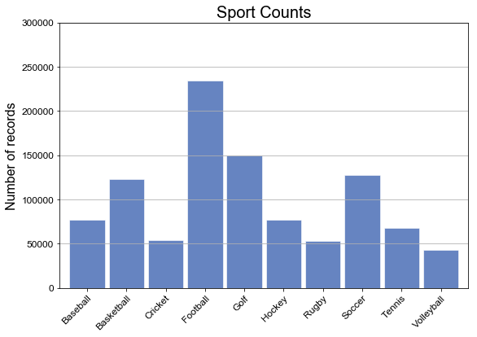
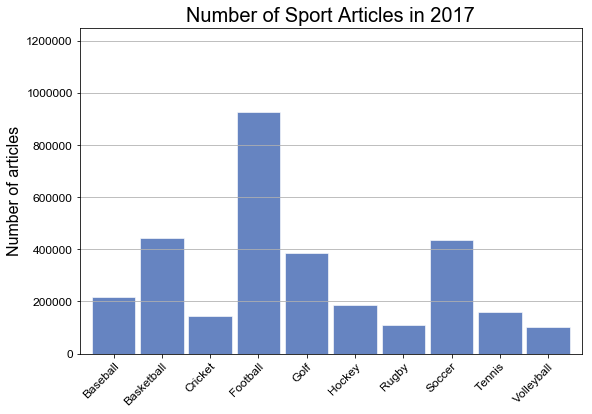
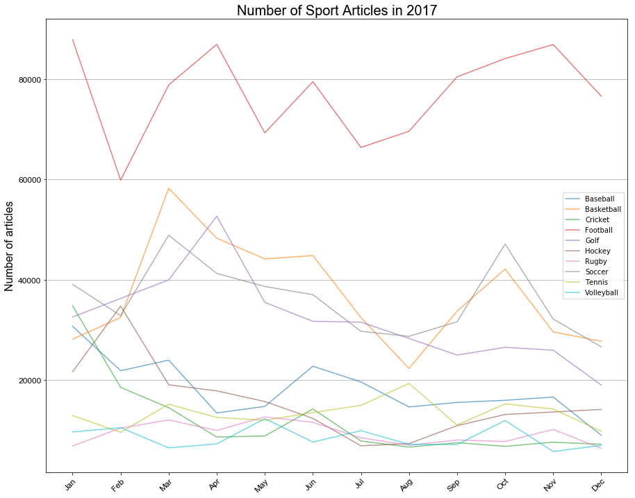

```python
# magic command to display matplotlib plots inline within the ipython notebook webpage
%matplotlib inline

# import necessary modules
import pandas as pd, numpy as np, matplotlib.pyplot as plt
import matplotlib.cm as cm, matplotlib.font_manager as fm
from datetime import datetime as dt
from time import time
import calendar
from shapely.geometry import Polygon
from geopy.distance import great_circle
from geopandas import GeoDataFrame

```


```python
# Read in input data and setup as a dataframe
# Grab Date and split date into year, month, day for processing. 
# The data files are encoded as utf-8: specify so to prevent matplotlib from choking on diacritics
df = pd.read_csv('school.csv', encoding='utf-8')
df['date'] = pd.to_datetime(df['date'], format='%Y%m%d')
df['year'], df['month'], df['day'] = df['date'].dt.year, df['date'].dt.month , df['date'].dt.day
df['month_name'] = df['month'].apply(lambda x: calendar.month_abbr[x])

```


```python
# Setup Fonts for any processing
title_font = fm.FontProperties(family='Arial', style='normal', size=20, weight='normal', stretch='normal')
label_font = fm.FontProperties(family='Arial', style='normal', size=16, weight='normal', stretch='normal')
ticks_font = fm.FontProperties(family='Arial', style='normal', size=12, weight='normal', stretch='normal')
annotation_font = fm.FontProperties(family='Arial', style='normal', size=11, weight='normal', stretch='normal')
```


```python
# Lets find the total number of articles per sport in the last year. 
# The description for this is not right.. I know.. Got to figure out better way to describe. 
countdata = df.groupby(df['sport']).size()
countdata

```


    sport
    Baseball       76941
    Basketball    122632
    Cricket        54032
    Football      234308
    Golf          149374
    Hockey         76937
    Rugby          52687
    Soccer        127104
    Tennis         67514
    Volleyball     43369
    dtype: int64


```python
# Create a Graph showing the data of all the Sports 
xlabels = pd.Series(countdata.index)

ax = countdata.plot(kind='bar',                 
                    figsize=[9, 6], 
                    width=0.9, 
                    alpha=0.6, 
                    color='#003399',
                    edgecolor='w',
                    grid=False,
                    ylim=[0, 300000])

ax.set_xticks(range(len(countdata.data)))
ax.set_xticklabels(countdata.index, rotation=45, rotation_mode='anchor', ha='right', fontproperties=ticks_font)
ax.yaxis.grid(True)
for label in ax.get_yticklabels():
    label.set_fontproperties(ticks_font)

ax.set_title('Sport Counts', fontproperties=title_font)
ax.set_xlabel('', fontproperties=label_font)
ax.set_ylabel('Number of records', fontproperties=label_font)

plt.show()
```





```python
## Total count of articles per sport for entire year
sumdata = df.groupby('sport').sum()
sumdata2 = pd.DataFrame(sumdata, columns=['count'])
sumdata2
```


<div>
<style scoped>
    .dataframe tbody tr th:only-of-type {
        vertical-align: middle;
    }

    .dataframe tbody tr th {
        vertical-align: top;
    }

    .dataframe thead th {
        text-align: right;
    }
</style>
<table border="1" class="dataframe">
  <thead>
    <tr style="text-align: right;">
      <th></th>
      <th>count</th>
    </tr>
    <tr>
      <th>sport</th>
      <th></th>
    </tr>
  </thead>
  <tbody>
    <tr>
      <th>Baseball</th>
      <td>218943</td>
    </tr>
    <tr>
      <th>Basketball</th>
      <td>444089</td>
    </tr>
    <tr>
      <th>Cricket</th>
      <td>143215</td>
    </tr>
    <tr>
      <th>Football</th>
      <td>926165</td>
    </tr>
    <tr>
      <th>Golf</th>
      <td>384996</td>
    </tr>
    <tr>
      <th>Hockey</th>
      <td>187479</td>
    </tr>
    <tr>
      <th>Rugby</th>
      <td>111434</td>
    </tr>
    <tr>
      <th>Soccer</th>
      <td>433717</td>
    </tr>
    <tr>
      <th>Tennis</th>
      <td>160358</td>
    </tr>
    <tr>
      <th>Volleyball</th>
      <td>102869</td>
    </tr>
  </tbody>
</table>
</div>


```python
# Create a Graph showing the data of all the Sports 
xlabels = pd.Series(sumdata2.index)

ax = sumdata2.plot(kind='bar',                 
                    figsize=[9, 6], 
                    width=0.9, 
                    alpha=0.6, 
                    color='#003399',
                    edgecolor='w',
                    grid=False,
                    legend=False,
                    ylim=[0, 1250000])

ax.set_xticks(range(len(sumdata2)))
ax.set_xticklabels(sumdata2.index, rotation=45, rotation_mode='anchor', ha='right', fontproperties=ticks_font)
ax.yaxis.grid(True)
for label in ax.get_yticklabels():
    label.set_fontproperties(ticks_font)

ax.set_title('Number of Sport Articles in 2017', fontproperties=title_font)
ax.set_xlabel('', fontproperties=label_font)
ax.set_ylabel('Number of articles', fontproperties=label_font)

plt.show()
```





```python
## Total count of articles per sport for per month for year
sumdata_2 = df.groupby(['sport','month']).sum()
sumdata_2_1 = pd.DataFrame(sumdata_2, columns=['count'])
sumdata_2_1.head(12)

```


<div>
<style scoped>
    .dataframe tbody tr th:only-of-type {
        vertical-align: middle;
    }

    .dataframe tbody tr th {
        vertical-align: top;
    }

    .dataframe thead th {
        text-align: right;
    }
</style>
<table border="1" class="dataframe">
  <thead>
    <tr style="text-align: right;">
      <th></th>
      <th></th>
      <th>count</th>
      <th>month_name</th>
    </tr>
    <tr>
      <th>sport</th>
      <th>month</th>
      <th></th>
      <th></th>
    </tr>
  </thead>
  <tbody>
    <tr>
      <th rowspan="12" valign="top">Baseball</th>
      <th>1</th>
      <td>30716</td>
      <td>NaN</td>
    </tr>
    <tr>
      <th>2</th>
      <td>21875</td>
      <td>NaN</td>
    </tr>
    <tr>
      <th>3</th>
      <td>23972</td>
      <td>NaN</td>
    </tr>
    <tr>
      <th>4</th>
      <td>13447</td>
      <td>NaN</td>
    </tr>
    <tr>
      <th>5</th>
      <td>14752</td>
      <td>NaN</td>
    </tr>
    <tr>
      <th>6</th>
      <td>22765</td>
      <td>NaN</td>
    </tr>
    <tr>
      <th>7</th>
      <td>19633</td>
      <td>NaN</td>
    </tr>
    <tr>
      <th>8</th>
      <td>14646</td>
      <td>NaN</td>
    </tr>
    <tr>
      <th>9</th>
      <td>15546</td>
      <td>NaN</td>
    </tr>
    <tr>
      <th>10</th>
      <td>15965</td>
      <td>NaN</td>
    </tr>
    <tr>
      <th>11</th>
      <td>16617</td>
      <td>NaN</td>
    </tr>
    <tr>
      <th>12</th>
      <td>9009</td>
      <td>NaN</td>
    </tr>
  </tbody>
</table>
</div>


```python
# Create a Graph showing the data of all the Sports 
data1 = sumdata_2_1.reset_index()
data1['month_name'] = data1['month'].apply(lambda x: calendar.month_abbr[x])
fig, ax = plt.subplots()

for key, grp in data1.groupby(['sport']):
    ax = grp.plot(ax=ax, 
                  kind='line', 
                  x='month_name', 
                  y='count', 
                  alpha=0.6, 
                  grid=False,
                  figsize=[15, 12],
                  label=key)
    
ax.set_xticks(range(max(data1.month)))
ax.set_xticklabels(data1.month_name, rotation=45, rotation_mode='anchor', ha='right', fontproperties=ticks_font)
ax.yaxis.grid(True)
for label in ax.get_yticklabels():
    label.set_fontproperties(ticks_font)

ax.set_title('Number of Sport Articles in 2017', fontproperties=title_font)
ax.set_xlabel('', fontproperties=label_font)
ax.set_ylabel('Number of articles', fontproperties=label_font)
    

plt.legend(loc='best')
plt.show()

```





```python
# This starts setting us up for the Geo work later. 
coords = df.as_matrix(columns=['lat', 'long'])

```
